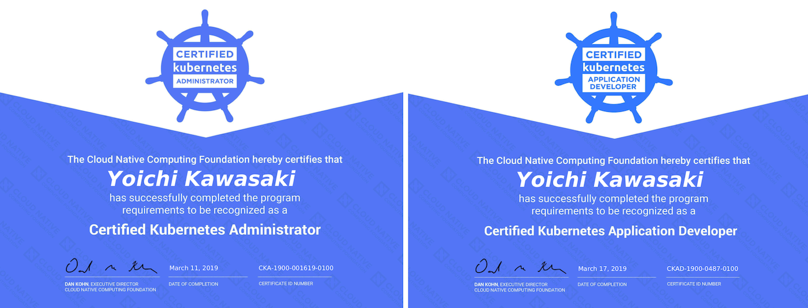

I've taken both [Certified Kubernetes Administrator (CKA)](https://www.cncf.io/certification/cka/) and [Certified Kubernetes Application Developer (CKAD)](https://www.cncf.io/certification/ckad/) exams in the past 2 weeks and fortunately passed both. This is a blog article on tips for both exams based on my experiences.

## About the exam and its curriculum

CKA focus on managing and operating kubernetes cluster including troubleshooting while CKAD forcus on managing and deploying applicaionts to kubernetes cluster.

It's very important to read and understand the exam curriculum and their relevant pages on kubernetes.io as all topics you're expected to understand are inlcuded in the curriculum and they are definitly going to be on the exam.

- [CKA and CKAD Curriculums](https://github.com/cncf/curriculum)
- [https://kubernetes.io](https://kubernetes.io)


## Tips for the exams

- Read and understand [the exam curriculum](https://github.com/cncf/curriculum) and their relevant pages on [kubernetes.io](https://kubernetes.io). You are allowed to look up the following pages
  - [kubernetes.io/docs](https://kubernetes.io/docs)
  - [kubernetes.io/blog/](https://kubernetes.io/blog/)
  - [github.com/kubernetes](https://github.com/kubernetes/)
- For both CKA and CKAD: Great Books to read: the following are books I've read and found useful for CKA and CKAD. They are defenitly helpful to understand how to manage and operate the kubernetes cluster. Pick one or two that you think good fit and read through:
  - Book: [Managing Kubernetes](http://shop.oreilly.com/product/0636920146667.do) (Free PDF by Heptio is [here](https://go.heptio.com/rs/383-ENX-437/images/Managing_Kubernetes.pdf))
  - Book(日本語): [Kubernetes完全ガイド](https://book.impress.co.jp/books/1118101055)
  - Book(日本語): [しくみがわかるKubernetes Azureで動かしながら学ぶコンセプトと実践知識](https://www.shoeisha.co.jp/book/detail/9784798157849)
  - Book(日本語): [Kubernetes実践入門 プロダクションレディなコンテナ＆アプリケーションの作り方](https://gihyo.jp/book/2019/978-4-297-10438-2)
- For CKA: learn how to install, configure & validate kubernetes cluster. These are good materials to go through:
  - [Kubernetes the hard way (GCP)](https://github.com/kelseyhightower/kubernetes-the-hard-way)
  - [Kubernetes the hard way on Azure (Azure)](https://github.com/ivanfioravanti/kubernetes-the-hard-way-on-azure)
- For CKA: learn how to troubleshoot the cluster. I recommend to read the following pages in kubernetes.io
  - [Determine the Reason for Pod Failure](https://kubernetes.io/docs/tasks/debug-application-cluster/determine-reason-pod-failure/)
  - [Application Introspection and Debugging](https://kubernetes.io/docs/tasks/debug-application-cluster/debug-application-introspection/)
  - [Debug Services](https://kubernetes.io/docs/tasks/debug-application-cluster/debug-service/)
- For CKA: these below are pages and books that I've read and thought very useful for CKA exam
  - GitHub: [Kubernetes-Certified-Administrator](https://github.com/walidshaari/Kubernetes-Certified-Administrator)
- For CKAD: these below are Github repo that I thought very very useful for CKAD exam preps:
  - Github: [CKAD Exercises](https://github.com/dgkanatsios/CKAD-exercises)
- For both: it's very important to know a quick way to achieve goals by using kubectl. You can lookup kubernetes.io during the exam but it's always good to know shortcut ways as the exam time is limited (CKA = 3hrs / CKAD = 2hrs)
  - [Kubectl Cheat Sheet](https://kubernetes.io/docs/reference/kubectl/cheatsheet/)
  - Creating template YAML using kubectl `dry-run` and edit it instead of creating YAML from scratch
    ```
    # Pod template
    $ kubectl run nginx --image=nginx --restart=Never --dry-run -o yaml
    # Deployment template
    $ kubectl run nginx --image=nginx  --dry-run -o yaml
    # Servcie template
    $ kubectl expose deployment nginx --type=NodePort --port 8080 --dry-run -o yaml
     
    # [NOTE1]
    # You can change resource to release by changing --restart option:
    # kind       |  option
    # ---------------------------------------------
    # deployment |  none
    # pod        |  --restart=Never
    # job        |  --restart=OnFailure
    # cronjob    |  --schedule='cron format(0/5 * * * ? など)'

    # [NOTE2]
    # In case that kubectl run will be deprecated in the future, 
    $ kubectl create deployment nginx --image=nginx --dry-run -o yaml
    ```
- Tips during the exam
  - ID: Candidates are required to provide government-issued photo identification before the Exam (Read [Candidate Handbook](https://www.cncf.io/certification/candidate-handbook)). For non-english language folks, `Passport` would be the best!
  - Testing Room: you need to prepare a room for testing which must be quiet, private and well lit.
  - Virtual screen: you can virtual screen like tmux and screen. It would be very helpful to use multple screens like using one for deploying kuberenetes resources while using the other one for looking up kuberentes resource state and logs. For example, I'm a tmux user, and added the following `.tmux.conf` before starting tackling with questions:
    ```
    set-option -g prefix C-z
    ```
  - Command alias: Setting up alias definitly help you to shorten the time you need to type in commands. For examples,
    ```sh
    alias k=kubectl
    ```
  - Time management: Don't spend too much time on difficult questions. Try to finish all easy questions first and spend the rest for difficult ones. You don't have to beat everything to pass the exam!! - A score of at least `74%` for `CKA` and `66%` for `CKAD` to pass the exam
  - Searchability: you can use and search the kubernetes.io pages. Even if you have no idea on questions on the exam, don't give up and try to type some keywords to search the kubernetes.io pages. You may be lucky enough to find some hints or right answers on the site.

## Final comments

Again, the most important tip for both exams is to read and understand [the exam curriculum](https://github.com/cncf/curriculum) and all relevant pages on [kubernetes.io](https://kubernetes.io). You don't have to memorize but understand them. Event if you don't come up with exact command options or kubernetes resource objects for questions in the exam, you can lookup and point to appropriate pages during the exam. In addition, get familiar with basic linux commands and cluster operations and management commands. If you have any questions, send DM to me [@yokawasa](https://twitter.com/yokawasa).

Good luck with your exams!

ps. Here are my Certificate IDs

